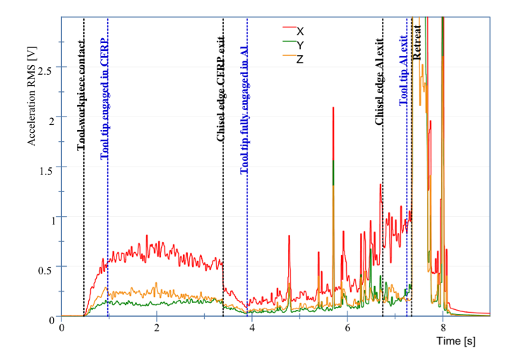

# Background

To improve product quality and working efficiency, adaptive drilling is proposed. 

# Definition

Incorporated with process monitoring approaches, adaptive drilling system can automatically make adjustments, such as process parameters(eg. spindle speed, feed rate and coolant settings).[^1]

## Example

+ Change spindle speed and feed rate depending on cutting material
+ Stop coolant spray when drill breaks through the workpieces
+ Change tool before incidents such as chip clogging and delaminiation

# Key points

The key points of the topic is listed below

+ An accurate perception methods
+ The relationship between parameters and cutting condition
+ Search and optimization methods

## Perception methods

The important cutting indexes are listed below

+ Cutting material
+ Tool's condition (usually wear level)
+ Product quality (eg. surface roughness and burr formation)

### Cutting material recognition

In cutting aluminum-composite stacked material, cutting procedure can be divided into 3 parts

+ Tool engagement
+ Material transition
+ Tool disengagement

#### Drill twist geometry

See [link](/drill-twist-introduction/)

#### Tool engagement

Tool begins to engage with workpiece during machining process. 

##### In milling process(slotting)

The angle is important and affects tool forces and temperatures.[^2]

#### Material transition

In this stage, signals in force, acceleration and acoustic emission(AE) will change gradually.

##### Force

Main features in material transition stage:

+ Force will increase **linearly** with tool wear
+ In the **same** drilling cycle, force in composite material is **lower** than in aluminum.
+ Oscillation can be found with **relatively low** frequency.
+ Come to 0 when tool break through the workpieces
+ Due to increase brought by tool wear, **single threshold classification** is not applicable.

##### Acceleration

The acceleration source comes from 

+ Independent source
    - Vibration from foundation
    - Part unbalance
    - Inertia forces
    - Driver inaccuracy
+ Dependent source
    - Non homogeneity
    - Property variation
    - Chatter, rotation frequency and mode coupling in tool engagement stage

Main features are listed below:

+ Vibration in **x-axis** is sensitive
+ Vibration in CFRP is **greater** than aluminum 
+ Peaks gets often as drilled hole increases
+ **Sudden rise** in tool disengagement leads to signal **saturated**

##### Acoustic emission

Main features are listed below:

+ Drop to 0 means tool's life ends
+ Magnitude rises with tool wear
+ Fluctuation indicates severe chip jamming
+ There is strong variation

#### Tool disengagement

Burr will form and final hole quality will be determined in this stage.

Point of angle determines chip formation.

| Point angle | Chisel edge | Chip property |
| :------- | :------: | -------: |
| > 118   |  Concave   |  Improve chip breaking |
| 118     |  Straight(Standard)  |   -                    |
| < 118   |  Convex    |  Prevent burr*         |

*: small point of angle will reduce edge strength and make it prone to chipping and fracturing.

## Relation between parameters and cutting condition

Useful papers

## Product quality prediction and optimization

Useful papers

This theme supports **link posts**, made famous by John Gruber. To use, just add `link: http://url-you-want-linked` to the post's YAML front matter and you're done.[^1]

> And this is how a quote looks.

Some [link](http://renyuanz.github.io) can also be shown.

# References

[^1]: Pardo, A., Majeed, M., & Heinemann, R. (2020). Process signals characterisation to enable adaptive drilling of aerospace stacks. Procedia CIRP, 88, 479-484.
[^2]: Adesta, E. Y. T., Hamidon, R., Riza, M., Alrashidi, R. F. F. A., & Alazemi, A. F. F. S. (2018). Investigation of tool engagement and cutting performance in machining a pocket. In IOP Conference Series: Materials Science and Engineering (Vol. 290, No. 1, p. 012066). IOP Publishing.