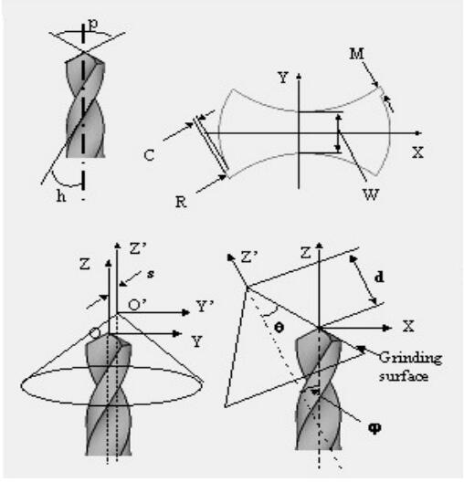
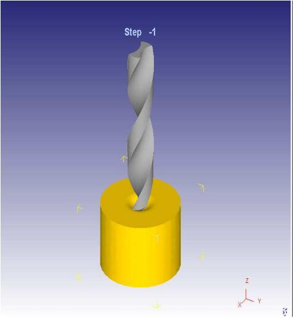
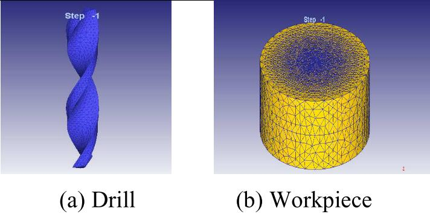
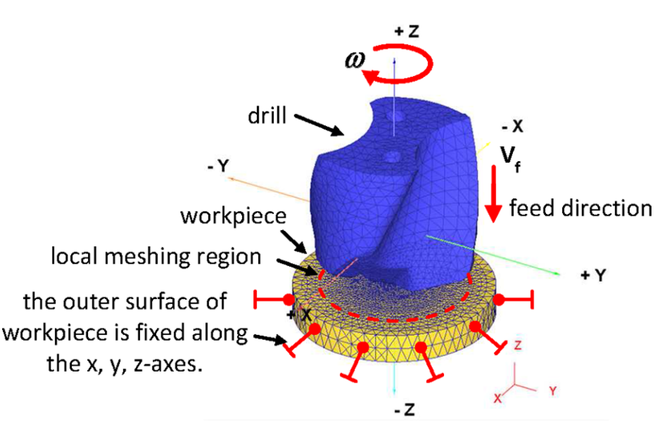

# Table of Contents

```toc
# This code block gets replaced with the TOC
```

# Background

With the development of machinery industry, higher requirements are put forward for product quality and machine efficiency. Drilling is one of the most significant cutting process which is often used in aerospace, aircraft and automotive industries. Drilling is a challenging operation due to complex interaction between material  and tool and progressive material failure in workpieces. Many approaches such as empirical, mechanistic, analytical and numerical have been proposed. In the past, lots of experiments are conducted to get series of related data during studies, which brings huge amount of material and tool consumption. Finite element methods can simulate the dynamics of drilling process virtually and in a way make up the drawback.

# Geometric model

## Drill geometry

Figure below shows the geometry of a drill. The parameter often used in listed in the following table.



| Parameters | Value |
| ------ | ----- |
| Diameter (mm) | 6 |
| Point angle (degree) | 118  | 
| Helix angle (degree) | 26 |
| R (mm)  | 3 |
| $\Theta$ (degree) | 35.86 |
| W (mm)| 0.9 |
| C (mm) | 4.53 |
| S (mm) | 1.19 |
| D (mm) | 3 |

## Workpiece geometry

The workpiece is created as a cylinder.[^3] [^4] In paper[^3], the diameter and height are 16mm and 10mm respectively. And there is a centering hole on the top surface of workpiece, whose depth is 1.1mm.



# Mesh

The tetrahedral mesh is used for the workpiece and carried out in two general stages, namely the first meshing and local meshing.

+ The first meshing is based on number of elements and element size ratio defined for the object
    + Element size ratio: the ratio of the largest element edge to the smallest element edge after the meshing, large size ratio such as 10 is used.
+ Local meshing: element size ratio of 0.1 around the hole




# Boundary condition

Boundary conditions consist of determining the **displacements** and **rotational / translational** movements of objects. The **interaction/ contact** conditions between the workpiece and drill.

The translational movement of drill in the direction of $-z$, which is both the feed direction and the axis od rotation, is defined by a constant speed $V_f$ (mm/s). The boundary condition os selected is **deformation/ velocity** and all nodes along the perimeter is fixed **in all directions**.





In terms of chip formation, the interaction/ contact conditions between workpiece and drill is defined:

+ Drill: master object causing deformation
+ Workpiece: slave object is being deformed

Coefficient of friction is chosen as 0.6[^5].

It is important to establish **initial contact** conditions to identify possible geometry problems to develop initial calculations. After a simulation starts running, the program automatically updates the contact conditions.

# Simulation controls

Simulation controls consist of settings

1. main
2. step
3. stop
4. re-mesh criterion
5. iteration

**Lagrangian** incremental simulation was used as the simulation type.

## Typical approaches

There are two main ways of approaching problems that involve the motion of deformable materials - the Lagrangian way and the Eulerian way. These approaches are distinguished by three important aspects: [^2]

1. The mesh description.
2. The stress tensor and momentum equation (kinetics).
3. The strain measure (kinematics).

### Lagrangian approach

It tracks discrete material point and use a use a predetermined line of separation at tool tip, then propagating a fictitious crack ahead of tool. This method precludes the resolution of the cutting edge radius and accurate resolution of the secondary shear zone due to severe mesh distortion.[^1]

### Eulerian approach

It tracks volumes rather than material particles and doesn't not have the burden of remeshing distorted meshes. However, steady state free-surface tracking algorithms were necessary and relied on assumptions such as uniform chip thickness, not allowing the modeling of milling processes or segmented chip formation.

## Stop parameters

Stopping parameters determine the process time when simulation terminates. The program terminates the simulation when any of these stop parameters that are *NSTEP*, *EMAX*, *TMAX*, *SMAX*, *VMIN*, and *LMAX*, respectively, are met. The calculated process time **(TMAX)** and the **total displacement** of the drill in the feed direction (primary die displacement, SMAX) were used as the stopping control parameters in simulations.

## Re-mesh criteria

+ Interference depth
+ Maximum time increment
+ Maximum step increment
+ Maximum stroke increment (only used in rolling operation)

If the prerequisite/ condition in any of these criteria is fulfilled or mesh becomes unusable(negative Jacobian), the object will be re-meshed. In the interference depth criterion, the distance between midpoint of an element edge on the meshed workpiece, which is in contact with the drill surface and it is considered as the absolute penetration distance. The relative interference depth criterion calculates the absolute penetration distance $l$, and divides it into $l_0$, which is the original edge length of the element, and finally obtains the relative penetration ratio l/l0. If the calculated $l/l_0$ ratio exceeds the default value of 0.7, the re-meshing process is triggered, and this process is repeated throughout the simulation process.

# References

[^1]: Marusich, T. D., Usui, S., Ma, J., Stephenson, D. A., & Shih, A. (2007). Finite element modeling of drilling processes with solid and indexable tooling in metals and stack-ups.
[^2]: https://en.wikiversity.org/wiki/Nonlinear_finite_elements/Lagrangian_and_Eulerian_descriptions
[^3]: Su, Y., Chen, D. D., & Gong, L. (2015, June). 3D Finite element analysis of drilling of Ti-6Al-4V Alloy. In International Conference on Computer Information Systems and Industrial Applications (pp. 907-911). Atlantis press.
[^4]: Yıldız, A., Kurt, A., & Yağmur, S. (2020). Finite element simulation of drilling operation and theoretical analysis of drill stresses with the deform-3D. Simulation Modelling Practice and Theory, 104, 102153.
[^5]: Soldani, X., Moufki, A., Molinari, A., Budak, E., & Özlü, E. (2008). High speed machining of AISI 1050 steel: modelling and experimental. International Journal of Material Forming, 1(1), 1439-1441.


