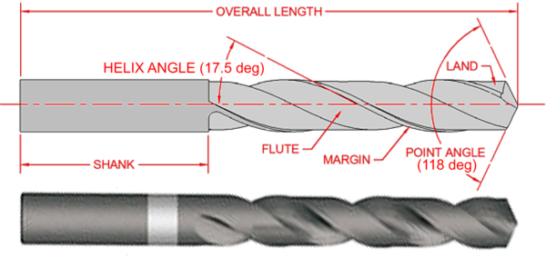

# Table of Contents

```toc
# This code block gets replaced with the TOC
```

# Definition

Drill twist is usually used to remove material to create holes. It's designed with a cone-like internal structure and narrow at the top of the web with gradually increasing thickness to the shank. [^1]



# Geometry characteristic

The major characteristic are listed below

+ Spiral (rate of twist)
+ Point angle
+ Lip angle
+ Function depth

## Spiral (rate of twist)

It can control **material removal rate**.

| Type | Feed rate | Spindle speed | Usage or common phenomenon |
| :------- | :------: | -------: | ------- |
| Fast spiral   | High |  Low | Remove large volume of chips |
| Low(elongated flute)    |  Traditional usage  | Traditional usage | Gall on bits or otherwise clog the hole, such as **aluminum** or copper |

## Point angle

Harder materials require a **larger** point angle, and softer materials require a **sharper** angle. The correct point angle for the hardness of the material influences wandering, chatter, **hole shape**, **burr formation**, and wear rate.

| Point angle | Chisel edge | Chip property |
| :------- | :------: | -------: |
| > 118   |  Concave   |  Improve chip breaking |
| 118     |  Straight(Standard)  |   -                    |
| < 118   |  Convex    |  Prevent burr         |

Small point of angle will reduce edge strength and make it prone to chipping and fracturing.

## Lip angle

It determines the amount of support provided to the cutting edge. A greater lip angle will cause the bit to cut more aggressively and leads to binding, wear and catastrophic failure. A flat bit is **sensitive** to small changes in lip angle due to small supporting area.

## Functional length

It determines how deep a hole can be drilled and also bit stiffness and hole accuracy. Longer bit can driller deeper but less stiffer, leading to location inaccuracy and axis wandering.

Common lengths are listed in below table:

| Type | Length | Extras |
| :------- | :------: | -------: |
| Stub-length or Screw-Machine-length   |  Short   |  - |
| Jobber-length  |  Medium  |  Very common     |
| Taper-length or Long-Series   |  Long    |  -  |


Syntax highlighting is a feature that displays source code, in different colors and fonts according to the category of terms. This feature facilitates writing in a structured language such as a programming language or a markup language as both structures and syntax errors are visually distinct. Highlighting does not affect the meaning of the text itself; it is intended only for human readers.[^1]

## Others

+ The diameter-to-length ratio is usually between 1:1 and 1:10.


### Fenced Code Blocks

```css
#container {
  float: left;
  margin: 0 -240px 0 0;
  width: 100%;
}
```

# References

[^1]: https://drilldoctor.in/pages/twist-drill-geometry-cutting-logic
[^:fig:Footnote for group named fig]: geo


