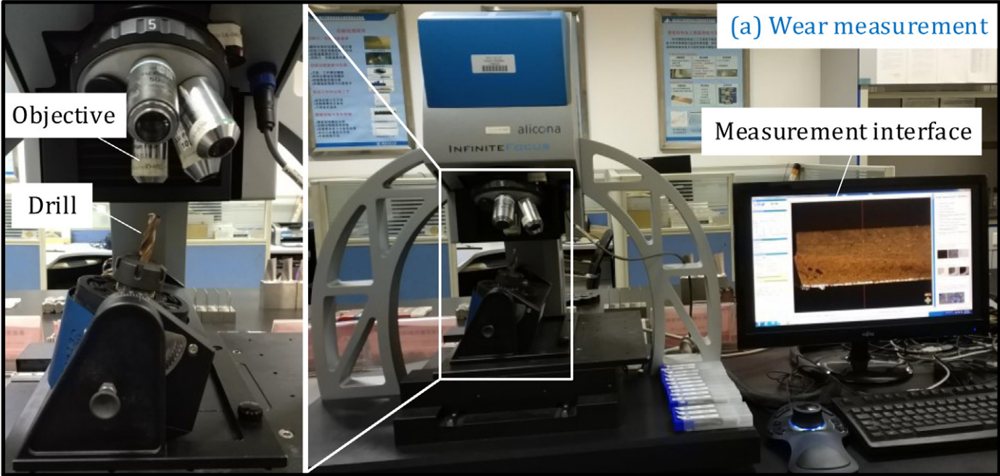
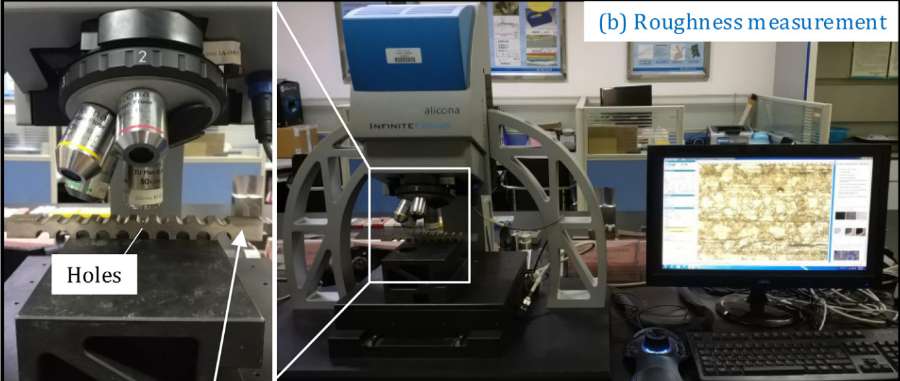

# Table of Contents

```toc
# This code block gets replaced with the TOC
```

# Aim

+ Recognize different drilling stages
+ Find the influence of subsampling frequency and its relations with drilling parameters
+ Parametric effects on borehole quality


# Experiment methodology

## Cutting workpiece

### Composition

+ CFRP
+ Aluminum

### Size

50mm * 50mm

### Joint

Clamped by bolt and screw

### Drilling tool

Twist drills

## Collected data

Drilling signal will be collected when tool wear, the thickness of both aluminum layer and CFRP will be measured.

Every time before drilling the next holes, the build-up edge and the residual chips in the drill flutes, if any, were cleared away to eliminate the influence of chips on the drilling forces.

### Sampling frequency

10000 Hz according to most researchers

### Signal

The following signal will be collected by sensor

| Signal type | Sensor |
| ----- | ----- |
| Acceleration | Dynamometer |
| Force | Dynamometer |
| Acoustic emission | AE sensor |
| Spindle power | \ |

### Optical measurements

+ Tool wear
    - Flank wear
    - Crater wear
    - Chisel wear
    - Outer corner wear
    - Cutting Edge rounding
+ Thickness of aluminum and CFRP layers
+ Borehole surface roughness

The wear and hole surface roughness are measured with Alicona optical 3D surface measurement device.

#### For Tool wear



#### For borehole surface roughness



### CFRP dummy plate

To extend tool life

## Variant cutting parameters

Drilling setup could follow recommended parameters from tool manufacturer's manual

+ Spindle speed(rev/min)
+ Feed rate(mm/rev)

# References

[^1]: Pardo, A., Majeed, M., & Heinemann, R. (2020). Process signals characterisation to enable adaptive drilling of aerospace stacks. Procedia CIRP, 88, 479-484.
[^2]: Adesta, E. Y. T., Hamidon, R., Riza, M., Alrashidi, R. F. F. A., & Alazemi, A. F. F. S. (2018). Investigation of tool engagement and cutting performance in machining a pocket. In IOP Conference Series: Materials Science and Engineering (Vol. 290, No. 1, p. 012066). IOP Publishing.
[^3]: Han, C., Luo, M., & Zhang, D. (2020). Optimization of varying-parameter drilling for multi-hole parts using metaheuristic algorithm coupled with self-adaptive penalty method. Applied Soft Computing, 95, 106489.