# Table of Contents

```toc
# This code block gets replaced with the TOC
```

# Introduction

Drilling is one of the most important cutting operations and widely used in aerospace, aircraft and automotive industries. In the process, tool will get blunt and it will lead to severe product failure because of tool's abrasive behavior. In order to improve manufacturing efficiency, extend product life, reduce energy and improve resource, tool wear monitoring is necessary to achieve the sustainable manufacturing.

In aerospace and aircraft manufacturing fields, advanced composite material such as fibre reinforced plastic (FRP) are widely used in key structure due to its excellent properties such as high specific strength, stiffness, low thermal expansion, good dimensional stability which are unobtainable with metal alloys.[^1] Although kinematic of composite cutting process remains the same as in metal cutting[^2], there are several differences due to the fact that composites are inhomogeneous and anisotropic material made from two constituents: the reinforcements which used to be **brittle** and the matrix tends to be **ductile**. It determines that the cutting and wear mechanism of composite material is quite different with metal.

In some cases, multi-material stacked structures comprising CFRP and metal alloys have been ever more common. It can make good use of each layer's property and brings improved strength and toughness of the assembly while reducing its overall weight. bolting and riveting of stacked structures offer an excellent assembly solution to the constrained designed.

When drilling stacks, the various layers are **clamped** and drilled **together** to eliminate misalignment of holes. It's a challenging task due to different material properties of each of the stacked structure. As is illustrated before, the cutting mechanism in composite and metal is different and leads to difficulty in product quality control.

# Cutting mechanism difference in metal and composite material

## Cutting edge geometry

The figure below shows two cutting edges of single point turning tool. Single point cutting tools consists of only one cutting edge which can perform matal removal action at a time. Shaping, planing, slotting, boring tools are also single point tool.[^4]

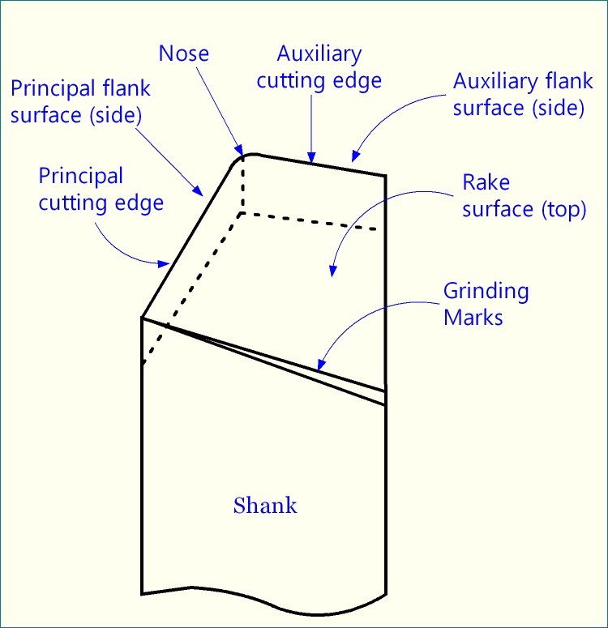

The table below shows the difference between metal and composite material

| Type | Metal | Composite material |
| :-------: | :------: | :-------: |
| Primary wear type   |  Crater and flank wear   | Edge rounding |
| Predominant wear mechanism | Erode, abrasion and sliding & rolling | Abrasion |
| Major machinability | Chip breakage | - |
| Major influential parameters|  | feed rate(double point angle)[^15] |
| Chip formation | Shear deformation |  Intermittent fractures and bouncing cutting force [^3] |
| Stagnation zone | √ | × |
| Failure modes | Flank wear, notch wear, crater wear, plastic deformation, built up edge, thermal crack, chipping and edge fracture | Fibre pullout, delamination, surface damage and burning being delamination |


The drilling operation is produced by two removal process:

+ Main cutting edge: eliminate most of material, cutting orthogonally and generate bulk of the **torque** and **cutting force**
+ Chisel edge: as a blunt edge with a high rake angle working as a punching process and producing most of the **thrust force**

### Stagnation zone

In Stagnation zone, work material **does not flow** as quickly as the work material flow in the **rake** and **flank** surface. Stagnation zone may either contain a **dead metal** that sticks on the **top** of the **cutting edge**, **never sliding** or may contain a stagnation point. The work material is being separated around the stagnation point either to **form chip** to **become the new surface** of the workpiece.

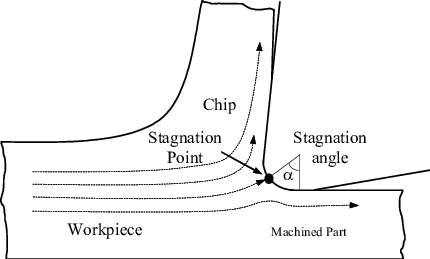

In machining metals the stagnant zone on cutting edge will **protect** the edge. [^14]. The cutting tool has been divided into 5 zones. Zone 1 and 5 don't have any **tribological contact** between work material and chip and **did not show any evidence** of wear. Zone 2 and 4 contacted the chip and machine surface, which are **crater** and **flank** wear respectively. Zone 3 doesn't exhibit any sign of wear due to **no relative velocity** between tool and work material.


The stagnation zone is stable during continuous chip formation, but may not stable in other type of chip formation process. The chip formation in CFRP material is dominated by the **fracture** without any stable stagnant zone. The work material flows around the cutting edge **without any disruption**, developing into the **edge rounding**. After the cutting edge become blunt, it can't efficiently cut the fibre, thus increasing the cutting force.

### Wear type

Depending on how wear is appearing it can be divided into three main groups: [^16]

+ Erosion 
+ Abrasion
+ Sliding & rolling

The wearing mechanism is in most cases divided in three phases: deterioration, loss of material and transportation of residual products.

+ Deterioration: material is aged at the damaged surface
+ Material loss: particles are removed through wearing mechanism
+ Residual product transportation: particles are transported away, but also remain squeezed between two surfaces

#### Erosion

It happens when a stream of particles hit tool surface. It requires **multiple hits** and leads to **fracture** of **brittle** materials. Loss of material on **ductile** material takes place as a combination of **chip formation**, **fatigue** and **shear failure**.

#### Abrasion

Wear caused by **hard particles** or **sharp tips** on a surface the wear is called abrasion. Material loss is dominated by chip forming, brittle fracture and fatigue. The abrasive particles can be chips from material which becomes hard through deformation harding or oxidation. 

If a sharp tip from one surface ploughs a groove in the other surface it is denominated two-part abrasion. 

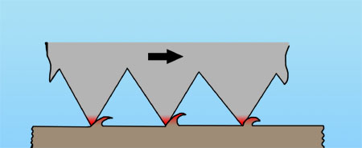

If it is a particle between two surfaces that causes the wear it is denominated three-part abrasion.

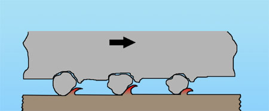

#### Sliding and rolling

Sliding and rolling wear between two surfaces may end in a great number of surface damage. The dominant mechanisms are shear and fatigue fracture, often proceed by oxidation and mechanical deterioration. One example of wear mechanism is adhesive wear when the tips of two surfaces sliding against each other are welded together and then torn apart. Wear through fatigue where small fragments are lost after repeated periods of rolling contact in for example roller bearings are further example of this type of wear mechanism.

### Different failure modes[^4]

The figure below shows three different wear type.[^6]

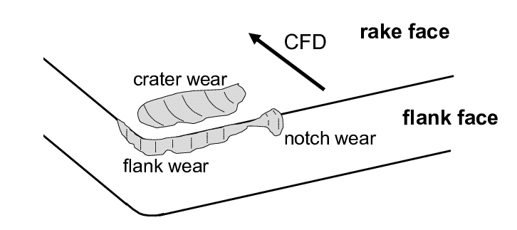

Figure below show the mechanism for friction and tool wear.[^13]

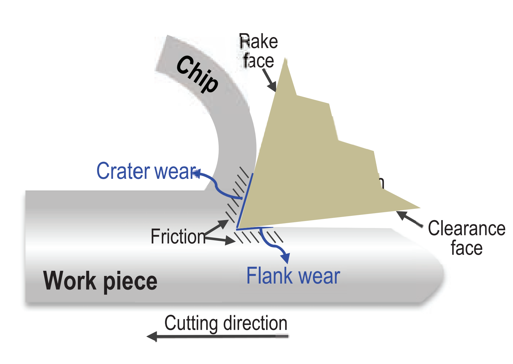

#### Flank wear

Flank wear is normal. All inserts will eventually wear out. The best situation is to have the insert wear through flank wear. However, premature flank wear is not desired. The ideal situation is when it is possible to extend the life of the insert before flank wear causes failure, thus minimizing cycle time.The cause of flank wear is generally abrasive wear caused by the **cutting speed**, the hardness of the part, or a hard skin on the material being removed. Flank wear occurs when **abrasion erodes the coating** and eventually the substrate. The **ideal flank wear** is an **even progression**, making the process **predictable**.Some remedies to reduce flank wear are to select a grade that has more wear resistance. As a quick fix, one could simply **slow the cutting speed**, thereby **increasing tool life** but **sacrificing cycle time**. Of course, the best solution is to keep cycle time as short as possible. The long-term solution is to select **a better grade**.

#### Notch wear

Notch wear appears as a notch on the insert, generally at the **depth of cut** level. It is an **oxidation** at the depth of cut. This oxidation is caused by **high temperatures** and the **presence of air**. Tungsten and cobalt, the main ingredients in carbide inserts, form weak oxide films during oxidation. To remedy notch wear, select a **more wear resistant grade**. Generally inserts coated with Al2O3 which can help prevent oxidation of the substrate. As a quick fix one could **increase the lead angle** on the tool. This would ease the insert into the material and would also provide "**chip thinning**". Another remedy would be to **vary the depth of cut**. In this way, the insert is not always cutting at the same depth of cut point. A variation of that method would be to make your **first** **pass a taper** and your next path a straight cut which would produce a constantly changing depth of cut.

#### Crater wear

Crater wear appears as a **diffusion** between the insert and the workpiece material. It occurs when **enough thermal energy** is created to enable the **exchange of atoms** across the tool-workpiece interface. The amount of diffusion depends on the **chemical affinity** between the two. For instance, **tungsten and steel have a high chemical affinity**. Effective remedies include using a **lower cutting speed**, or choosing **a grade with more wear resistance**. For instance, an Al2O3 coating helps to prevent diffusion and reduces crater wear. If you begin to **lose chip control**, check for crater wear because excessive types of this wear tend to **change the edge geometry** of the insert.

#### Edge plastic deformation

Compression and heat, combined with **high feeds** and **hard work materials**, cause deformation of the insert edge. As edge deformation increases from the **pressure**, **temperatures** continue to rise, contributing to further deformation. Look for the edge to **lose sharpness** and **bulge out** when this happens. A quick fix is to **reduce the speed or feed rate**. But for long-term productivity, a more **wear-resistant grade** is key.

#### Built-up edge

In single point cutting of metals, a built up edge (BUE) is an accumulation of material against the **rake face**, that seizes to the tool tip, separating it from the chip.[^7] 

The conditions necessary for a noticeable edge to build up are that:

+ the cutting speed is low.[^8] This is because at high cutting speeds the metal moving away from the workpiece becomes hot enough to recover before seizing onto the tool, preventing the formation of a BUE.[^9]
+ the metal being cut is one that work-hardens and is reluctant to recover.[^8] A BUE will not form with pure metals since they do not work-harden much. Conversely, alloys, such as steel, do work-harden and recover less so they are prone to forming a BUE.[^9]

A built-up edge is when the workpiece material gets **welded** to the cutting edge. This usually occurs when **cutting temperatures are too low**. Additional chip flow is needed to avoid it. The remedies to this are to **increase the cutting speed**, and select a **more positive** insert geometry. Another remedy would be to **increase the coolant flow** to add lubricity. In the case of aluminum, use a **polished insert** to increase lubricity. In gummy steels, use a **smooth, slippery coating**.

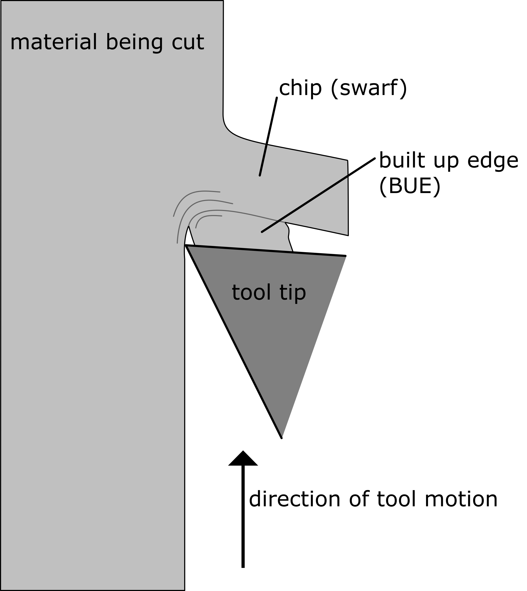

The built up edge effectively changes tool geometry and rake steepness. It also reduces the contact area between the chip and the cutting tool,[^7] leading to:

+ A **reduction in the power** demand of the cutting operation.[^7]
+ **Slight increase** in tool life, since the cutting is partly being done by the built up edge rather than the tool itself.[^10]

However, the formation of BUEs have negative effects on the quality of the workpiece,[^7] specifically:

+ Excessive **work hardening** at the surface of the workpiece.[^7]
+ **Poor surface finish**, since bits of the BUE eventually break off and stick to the workpiece. These bits tend to be problematic since, due to the work-hardening they underwent, they are very hard and so become abrasive.[^7]
+ A **reduction** in the **dimensional control** of the process, due to the dynamically changing geometry of the cutting tool.

#### Thermal cracking

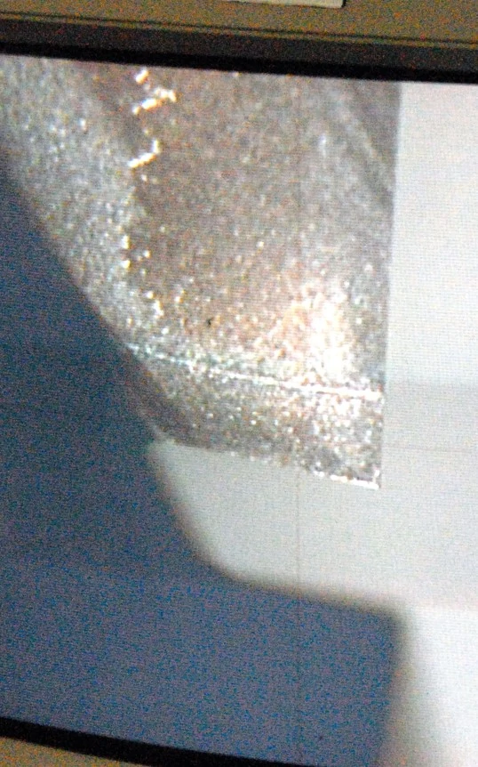

Thermal Cracking is caused by **abrupt temperature changes**. A quick remedy is to **turn the coolant off completely**, or by drenching the tool in coolant to **stabilize the temperature**. Using a tougher, more **wear-resistant grade** is also an effective solution. When doing interrupted cutting, always run without coolant. 

Thermal cracking is often identified by cracks in the tool **perpendicular** to the cutting edge. Cracks form **slowly**, but they can lead to both **chipping** and **premature tool failure**. 

#### Chipping

Chipping can be easily identified by a **nicked** or **flaked** edge on the cutting tool, or by examining the surface finish of a part. A poor surface finish can often indicate that a tool has experienced some sort of chipping, which can lead to eventual catastrophic tool failure if it is not caught.[^11]

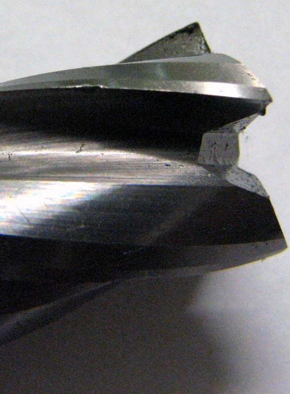

Chipping occurs when the insert edge **breaks** rather than wears. The fatigue associated with chipping is generally caused by **temperature** and **force fluctuations**. It usually means that the application is too demanding for the selected insert. To remedy this, it is necessary to select an insert with a **stronger cutting edge**. Also, try a **tougher, more shock-resistant** grade of carbide.

#### Edge Fracture

Fracture is the complete loss of tool usage due to sudden breakage, often as a result of improper speeds and feeds, an incorrect coating, or an inappropriate depth of cut. Tool holder issues or loose work holding can also cause a fracture, as can inconsistencies in workpiece material properties.[^11]

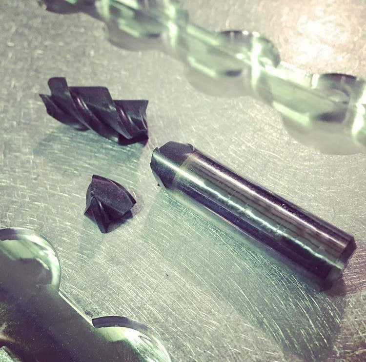

Edge fracture happens as a result of the other wear types. Remedy check all the cutting data and setup to consider what it might be. Once the edge fractures, the reason is **unknown**. Ideally, you want to check the insert before a fracture occurs to determine why such an incident might happen. The likely remedies for this are to **reduce the feed rate**, **reduce the cutting speed**, or select a **tougher** grade.

#### Fibre pullout

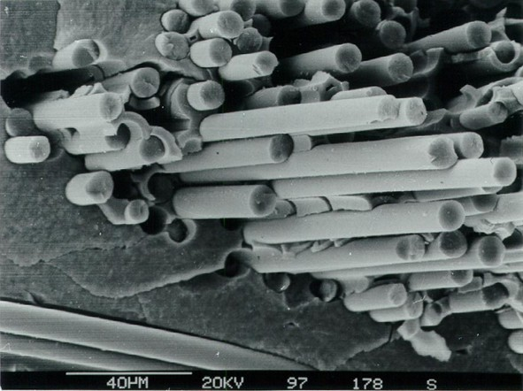

Fiber pull-out is one of the failure mechanisms in fiber-reinforced composite materials. Other forms of failure include **delamination**, **intralaminar matrix cracking**, **longitudinal matrix splitting**, **fiber/matrix debonding**, and **fiber fracture**. The cause of fiber pull-out and delamination is **weak bonding**. [^12]

#### Delamination

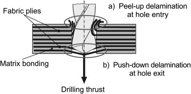

Delamination is a mode of failure where a material fractures into layers. In laminated composites, the adhesion between layers often fails first causing the layers to separate. In fiber-reinforced plastics, sheets of high strength reinforcement (e.g., carbon fiber, fiberglass) are bound together by a much weaker polymer matrix (e.g., epoxy). In particular, loads applied **perpendicular** to the high strength layers, and **shear loads** can cause the polymer matrix to fracture or the fiber reinforcement to debond from the polymer.

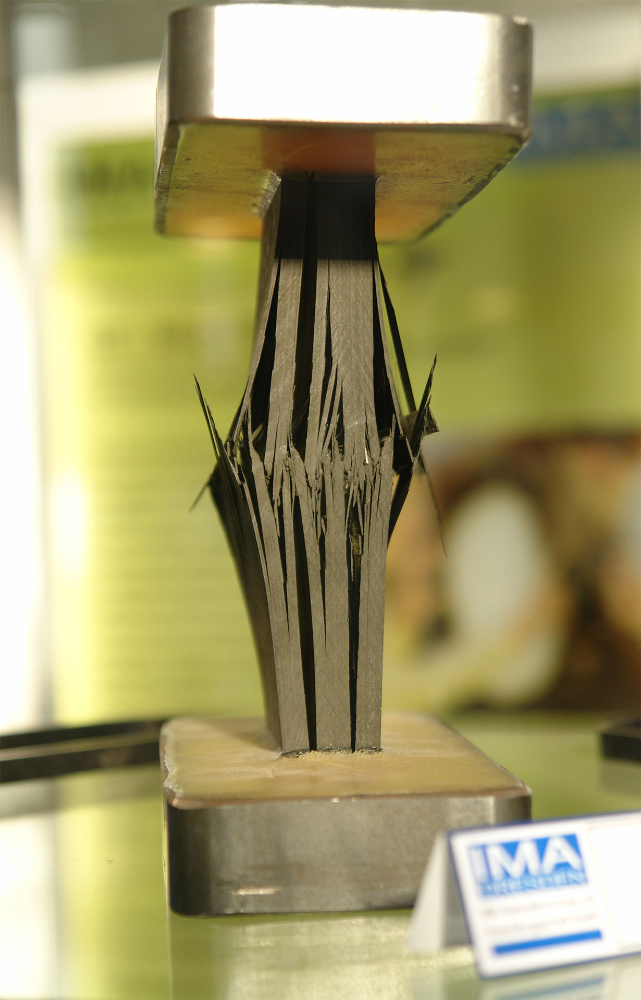

## For metal


## For composite material

# Common tool wear symptoms

In failure analysis, workers will check condition at predetermined intervals and compare condition of insert with typical failure modes. Once the other failure modes have been corrected, measuring **flank wear** can then be the determinant of tool life.

+ Visible signs on the insert
+ Load Meter
+ Part Size
+ Work-piece Finish
+ Burr Generated
+ Work-piece Temperature
+ Vibrations
+ Sound
+ Chatter
+ Color of Chip
+ Chip Control

# References

[^1]: Arul, S. V. L. M. S., Vijayaraghavan, L., Malhotra, S. K., & Krishnamurthy, R. (2006). The effect of vibratory drilling on hole quality in polymeric composites. International Journal of Machine Tools and Manufacture, 46(3-4), 252-259.
[^2]: Sheikh-Ahmad, J. Y. (2009). Machining of polymer composites (Vol. 387355391). New York: Springer.
[^3]: Fernández-Pérez, J., Cantero, J. L., Díaz-Álvarez, J., & Miguélez, M. H. (2017). Influence of cutting parameters on tool wear and hole quality in composite aerospace components drilling. Composite Structures, 178, 157-161.
[^4]: http://www.minaprem.com/machining/cutter/geometry/what-is-cutting-edge-in-cutting-tool-its-function-sharpness-and-numbers/
[^5]: https://www.canadianmetalworking.com/canadianmetalworking/news/metalworking/failure-modes-how-they-can-improve-your-machining-processes
[^6]: Fallqvist, M. (2012). Microstructural, mechanical and tribological characterisation of CVD and PVD coatings for metal cutting applications (Doctoral dissertation, Uppsala universitet).
[^7]: The Open University (UK), 2001. T881 Manufacture Materials Design: Block 2: Cutting, page 14. Milton Keynes: The Open University.
[^8]: The Open University (UK), 2001. T881 Manufacture Materials Design: Block 2: Cutting, page 14 and 15. Milton Keynes: The Open University.
[^9]: The Open University (UK), 2001. T881 Manufacture Materials Design: Block 2: Cutting, page 15. Milton Keynes: The Open University.
[^10]: Rao, P.N. (2009). Manufacturing Technology - 2, Metal cutting and Machine tools. New Delhi: Tata McGraw-Hill. pp. 9–11. ISBN 978-0-07-008769-9.
[^11]: https://www.harveyperformance.com/in-the-loupe/tag/thermal-cracking/
[^12]: https://en.wikipedia.org/wiki/Fiber_pull-out
[^13]: Wang, P., & Gao, R. X. (2016). Stochastic tool wear prediction for sustainable manufacturing. Procedia Cirp, 48, 236-241.
[^14]: Schmidt J. Mechanical and thermal effects in turn hardened steels. Dissertation of University Hannover; 1999.
[^15]: Karpat, Y., Değer, B., & Bahtiyar, O. (2012). Drilling thick fabric woven CFRP laminates with double point angle drills. Journal of materials processing technology, 212(10), 2117-2127.
[^16]: https://xapps.xyleminc.com/Crest.Grindex/help/grindex/contents/wear01.htm